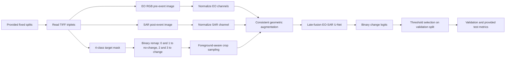
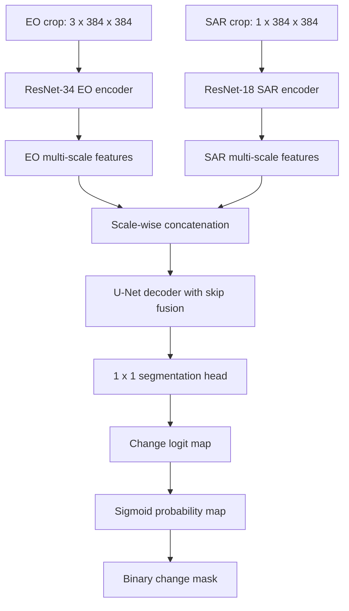
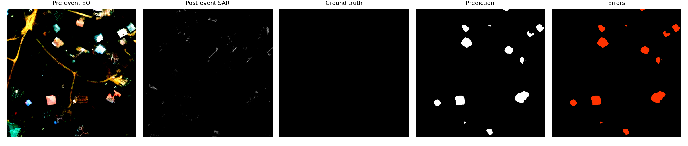
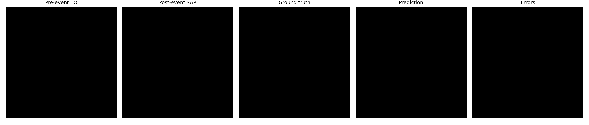
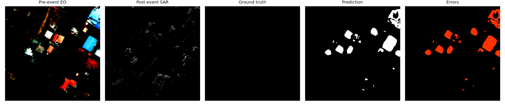
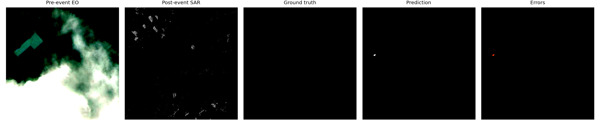
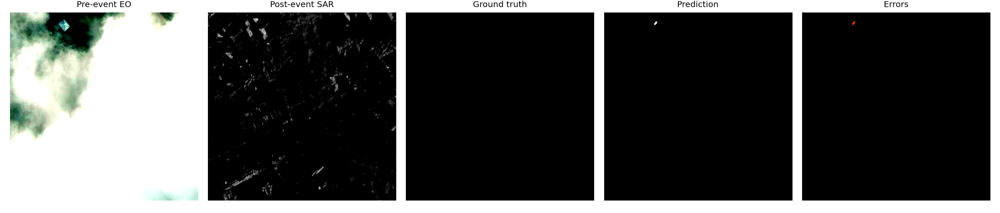

# Binary Change Detection on EO-SAR Image Pairs

## 1. Abstract

This report presents an end-to-end solution for binary pixel-level change detection on paired Electro-Optical (EO) and Synthetic Aperture Radar (SAR) imagery. The task is to classify each pixel as no-change or change using the provided GalaxEye dataset and fixed train, validation, and test splits. No external remote-sensing imagery is used for training or fine-tuning. The original four annotation classes are remapped according to the assignment requirement: background and intact pixels are no-change, while damaged and destroyed pixels are change.

The final system uses a dual-encoder late-fusion U-Net. The EO branch uses an ImageNet-pretrained ResNet-34 encoder, and the SAR branch uses an ImageNet-pretrained ResNet-18 encoder adapted for one-channel SAR input. Multi-scale decoder skip connections fuse modality-specific EO and SAR features. The model is trained with BCE-Dice loss, conservative positive-class weighting, foreground-aware crop sampling, and EO/SAR-specific augmentations to address severe class imbalance and modality shift. On the validation split, the best threshold sweep result achieved IoU 0.4385, precision 0.6210, recall 0.5987, and F1 0.6097. On the provided test split, performance dropped substantially, with the copied final diagnostic run achieving IoU 0.0573 and F1 0.1085. This gap is the main limitation of the submission and is discussed as cross-scene domain shift and calibration failure.

## 2. Literature Survey

Remote-sensing change detection has traditionally used image differencing, image ratioing, change vector analysis, thresholding, and post-processing. These classical methods are interpretable and computationally inexpensive, but they are sensitive to illumination differences, speckle, registration error, seasonal variation, and cross-sensor appearance shifts. These limitations are especially important in EO-SAR data, where the optical and radar modalities measure different physical properties.

Fully convolutional neural networks reframed change detection as dense prediction. U-Net is a natural baseline because its encoder captures semantic context while decoder skip connections preserve spatial detail. For building-level disaster analysis, this matters because damaged structures can occupy small, fragmented regions and boundary quality affects IoU directly.

Daudt et al. introduced fully convolutional Siamese architectures for remote-sensing change detection, including early-fusion and feature-difference variants. This work is relevant because it showed that change detection benefits from comparing learned feature representations rather than only comparing raw pixels. STANet later introduced spatial-temporal attention for bitemporal remote-sensing imagery, improving the ability to compare features across time and location. Transformer-based approaches such as BIT and ChangeFormer further model long-range relationships and global context, which can help when change evidence is spatially distributed or when local texture alone is ambiguous.

EO-SAR fusion is more difficult than same-sensor bitemporal change detection. EO imagery provides visible spectral and texture cues, while SAR provides microwave backscatter that is robust to clouds and illumination but affected by speckle and viewing geometry. A single early-fusion encoder can work, but it forces one low-level feature extractor to handle two very different distributions. A dual-encoder architecture is therefore a conservative and technically motivated choice: the EO and SAR branches learn modality-specific features before fusion in the decoder.

More advanced future candidates include STANet-style attention, BIT/ChangeFormer-style transformer comparison, SNUNet-CD dense Siamese skip connections, and EO-SAR fusion architectures with explicit cross-attention. For this assignment, I prioritized a reproducible dual-encoder CNN because the dataset is limited, the change class is extremely imbalanced, and robust engineering and analysis are part of the evaluation criteria.

Key papers and resources consulted:

- Ronneberger, Fischer, and Brox, "U-Net: Convolutional Networks for Biomedical Image Segmentation", MICCAI 2015.
- He, Zhang, Ren, and Sun, "Deep Residual Learning for Image Recognition", CVPR 2016.
- Daudt, Le Saux, and Boulch, "Fully Convolutional Siamese Networks for Change Detection", ICIP 2018.
- Chen and Shi, "A Spatial-Temporal Attention-Based Method and a New Dataset for Remote Sensing Image Change Detection", Remote Sensing 2020.
- Chen, Qi, and Shi, "Remote Sensing Image Change Detection with Transformers", IEEE TGRS 2022.
- Bandara and Patel, "A Transformer-Based Siamese Network for Change Detection", IGARSS 2022.
- Fang et al., "SNUNet-CD: A Densely Connected Siamese Network for Change Detection of VHR Images", IEEE GRSL 2022.
- PyTorch and torchvision documentation/codebase for implementation details and pretrained ResNet backbones.

## 3. Methodology

### Data Understanding and Label Remapping

Each sample contains a pre-event EO image, a post-event SAR image, and a pixel-level target mask. The EO image is RGB with shape `1024 x 1024 x 3`; the SAR image is single-channel with shape `1024 x 1024 x 1`; and the target mask has shape `1024 x 1024 x 1`.

The mandatory binary remapping is:

| Original value | Original class | Binary value | Binary class |
| ---: | --- | ---: | --- |
| 0 | Background | 0 | No-change |
| 1 | Intact | 0 | No-change |
| 2 | Damaged | 1 | Change |
| 3 | Destroyed | 1 | Change |

The implementation applies this as `mask >= 2`. This remap is used consistently for training, validation, test evaluation, distribution statistics, and visualisation.

The observed class distribution after remapping is highly imbalanced:

| Split | Samples | Change fraction |
| --- | ---: | ---: |
| Train | 2781 | 1.57% |
| Validation | 334 | 2.20% |
| Provided test | 77 | 0.75% |

This imbalance strongly influenced the modelling choices. A naive model can achieve high pixel accuracy by predicting no-change almost everywhere, while an overly aggressive positive weighting can produce many false positives.

### System Overview

The full pipeline is summarized below.



### Architecture

The final model is a late-fusion U-Net with two modality-specific encoders:

- EO branch: ResNet-34 pretrained on ImageNet, operating on the RGB EO image.
- SAR branch: ResNet-18 pretrained on ImageNet, with the first convolution adapted from three input channels to one SAR channel.
- Fusion: EO and SAR feature maps are concatenated at each encoder scale and passed into a U-Net-style decoder.
- Output: a single-channel logit map with the same spatial resolution as the input crop.

This design was chosen because EO and SAR have different image statistics. Keeping separate encoders allows each branch to learn modality-specific low-level features before combining them for dense change prediction.

The model flow is:



### Training Strategy

The final configuration trains on the official training split and validates on the official validation split. The model uses random crops of size `384 x 384`. This crop size is a compromise between spatial context, GPU memory, and training speed. On the available Kaggle T4 x2 setup, the final recipe trains in approximately 5 minutes per epoch, including validation.

The optimizer is AdamW with cosine learning-rate scheduling. Mixed precision training is enabled for CUDA. The final run trains for 35 epochs without early stopping because intermediate validation behavior can be noisy and later epochs may recover.

The training loop saves both the latest checkpoint and the best validation-IoU checkpoint. The best checkpoint was selected using validation IoU during training. After training, threshold sweeps were used to study probability calibration and the validation-test gap.

The final training configuration is:

| Setting | Value |
| --- | --- |
| Input channels | 4 (`RGB EO + SAR`) |
| Crop size | `384 x 384` |
| Epochs | 35 |
| Batch size | 16 |
| Optimizer | AdamW |
| Learning rate | 0.00025 |
| Weight decay | 0.01 |
| Scheduler | Cosine |
| Mixed precision | Enabled |
| Loss | BCE-Dice |
| BCE weight | 0.25 |
| Dice weight | 0.75 |
| Positive class weight | 8.0 |
| Dropout | 0.30 |
| Early stopping | Disabled |

### Loss Function and Class Imbalance

The loss is a BCE-Dice combination:

- BCE provides per-pixel supervision.
- Dice loss directly optimizes overlap and is more robust under class imbalance.

The final configuration uses conservative positive weighting (`pos_weight = 8.0`) rather than the raw training-set imbalance ratio of approximately 62.7. Early experiments showed that using the raw ratio encouraged very high recall but extremely low precision, causing many false positives and poor test transfer. The final weighting is therefore a deliberate trade-off: it still emphasizes rare change pixels, but avoids forcing the model to predict change too aggressively.

Foreground-aware crop sampling is used with probability `0.30`. This increases exposure to rare changed pixels while preserving enough background/no-change crops to keep calibration realistic.

### Augmentation

The final data augmentations are:

- Horizontal and vertical flips.
- Random 90-degree rotations.
- EO grayscale conversion with probability 0.35.
- EO brightness and contrast jitter with probability 0.50.
- EO channel shuffle with probability 0.15.
- SAR multiplicative speckle augmentation with probability 0.45.

The geometric augmentations are applied to EO, SAR, and mask consistently. EO and SAR appearance augmentations are modality-specific. These augmentations are intended to reduce scene-specific overfitting and improve robustness to cross-scene appearance variation.

### Experiments and Design Changes

Several configurations were tested during development. A heavier difference-fusion U-Net added explicit absolute feature differences between EO and SAR feature maps. It improved validation behavior in some settings, but was slower and showed poor transfer to the provided test scenes. Experiments also showed that very large positive weighting and high foreground crop probability produced high recall but many false positives. Any experimental run that did not use the mandatory `0,1 -> 0` and `2,3 -> 1` remapping was excluded from final reporting. The final configuration therefore uses the lighter late-fusion model, stronger dropout, lower positive weighting, and lower foreground crop probability.

## 4. Results

All metrics are computed for the change class (`label = 1`). The confusion matrix is reported as `[[TN, FP], [FN, TP]]`. The main formulas are:

- IoU = `TP / (TP + FP + FN)`
- Precision = `TP / (TP + FP)`
- Recall = `TP / (TP + FN)`
- F1 = `2 * Precision * Recall / (Precision + Recall)`

The validation sweep selected threshold `0.80` as the best validation-IoU threshold. The copied test diagnostic available at report time was run at threshold `0.90`; it is included below because it is the exact test metric row retained from the final notebook output. A later full-image check was approximately `0.08` IoU and showed the same failure mode: very low recall on the provided test scenes.

### Quantitative Results

| Split | Threshold | IoU | Precision | Recall | F1 | Confusion Matrix `[[TN, FP], [FN, TP]]` |
| --- | ---: | ---: | ---: | ---: | ---: | --- |
| Validation | 0.80 | 0.4385 | 0.6210 | 0.5987 | 0.6097 | `[[47209631, 546090], [599707, 894876]]` |
| Provided test | 0.90 | 0.0573 | 0.2911 | 0.0666 | 0.1085 | `[[11252969, 14125], [81219, 5799]]` |

The validation score is much higher than the provided test score. The most important observation is not only the lower IoU, but the collapse in recall on the test split: the model predicts relatively few changed pixels and misses most positive pixels. This indicates that the validation split was not a reliable proxy for the provided test scenes.

### Qualitative Visualisations

The qualitative grids show the pre-event EO image, post-event SAR image, ground-truth binary mask, predicted mask, and error map. The examples include both reasonable localization and failure modes such as missed damaged structures and imperfect boundaries.

Example 1:



Example 2:



Example 3:



Example 4:



Example 5:



These examples cover:

- Clear success case with good damaged-region localisation.
- False positive case around intact buildings or strong SAR backscatter.
- False negative case where small damaged structures are missed.
- Boundary-error case where predicted change is spatially shifted or over-smoothed.
- Low-change crop where the model must avoid predicting damage everywhere.

Visualisations are generated with:

```bash
python eval.py \
  --config config.yaml \
  --data_path data/raw/test/test \
  --weights outputs/checkpoints_final_conservative/best.pth \
  --output outputs/metrics/test_metrics.json \
  --threshold 0.80 \
  --visualize \
  --vis_dir outputs/visualizations/test \
  --device cuda
```

### Error Profile

Expected error modes are:

- False positives on intact buildings whose SAR backscatter resembles damaged regions.
- False negatives for very small, thin, or low-contrast damaged structures.
- Boundary errors due to crop-level training and imperfect pixel-level annotation alignment.
- Cross-scene calibration errors because the provided test split has a lower change fraction than the validation split.

The observed validation-test gap suggests that the model learned useful damage cues but did not generalize robustly to the provided test scenes. The provided test split has a much lower change fraction than validation, and the model's probability calibration does not transfer cleanly under that distribution shift.

## 5. Future Work

If this assignment were my first-month deliverable as a GalaxEye intern, I would pursue the following next steps.

First, I would build an event-aware validation protocol. The official validation split is required for reporting, but internal scene- or event-holdout validation is important for estimating blind-test generalization. I would maintain both official metrics and an internal unseen-event benchmark.

Second, I would explore architectures that compare EO and SAR features more explicitly. Candidate directions include cross-attention fusion, Siamese feature-difference decoders, STANet-style spatial attention, BIT/ChangeFormer-style transformer comparison, and SNUNet-CD-style dense skip fusion. I would compare these against the current late-fusion U-Net under the same data split and metric protocol.

Third, I would improve class-imbalance handling. I would test focal-Tversky loss, online hard example mining, false-positive mining around intact buildings, and calibration-aware threshold selection. Because test change prevalence is lower than validation prevalence, probability calibration is a key issue.

Fourth, I would improve data efficiency and training speed. The current pipeline reads TIFF files on the fly. Preprocessing the dataset into cached tensors or patch shards would reduce CPU I/O overhead and make larger hyperparameter sweeps feasible.

Fifth, I would perform systematic error analysis by scene and by object scale. This would identify whether failures are dominated by SAR speckle, EO/SAR appearance mismatch, small-object misses, or annotation boundary ambiguity.

## 6. Conclusion

This work implements a complete, reproducible EO-SAR binary change detection pipeline using the provided dataset only. The system includes mandatory label remapping, data inspection, class-imbalance-aware training, a dual-encoder EO/SAR segmentation model, threshold-based evaluation, confusion matrices, and qualitative visualisation support.

The main limitation is generalization across geographically different scenes. The validation split reached a reasonable IoU, but the provided test split exposed a severe recall failure. This indicates that the current model is not yet robust to the distribution shift between validation and test events. The key takeaway is that the pipeline is reproducible and correctly handles the assignment label mapping, but the model requires stronger event-level validation, calibration, and EO-SAR fusion strategies before it can be considered reliable for unseen disasters.
